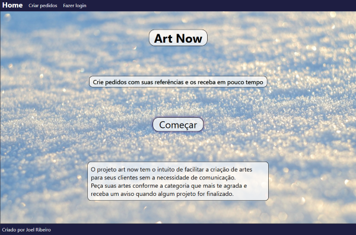
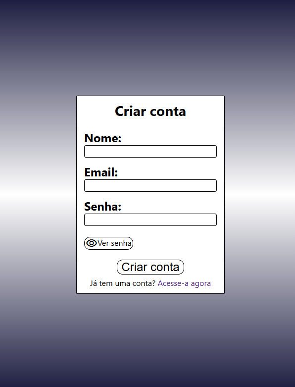
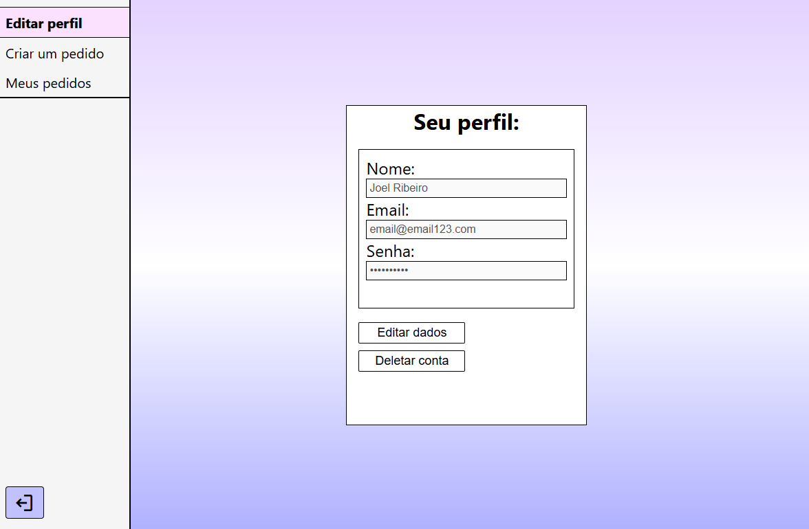
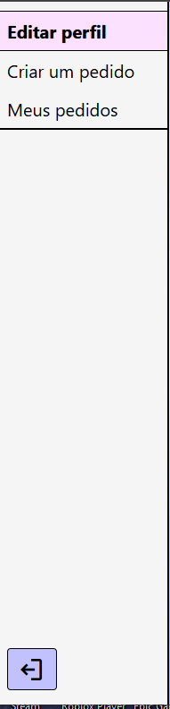
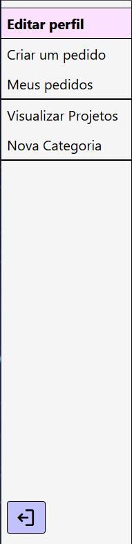
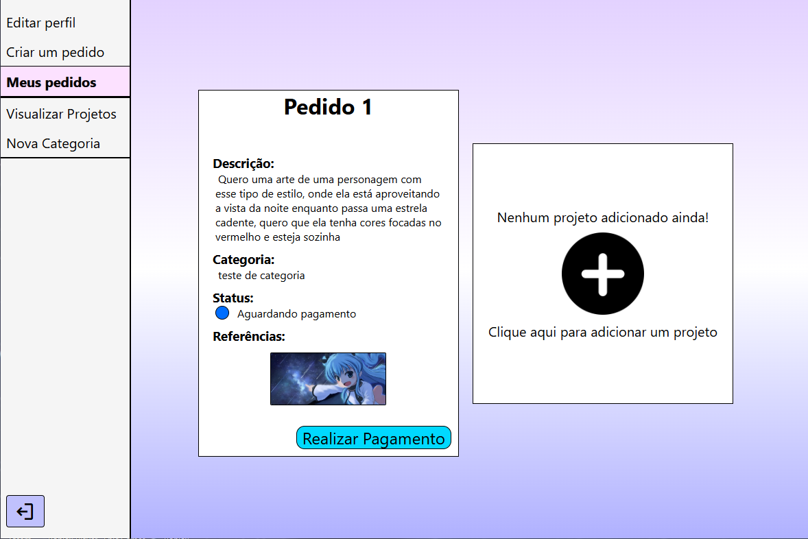
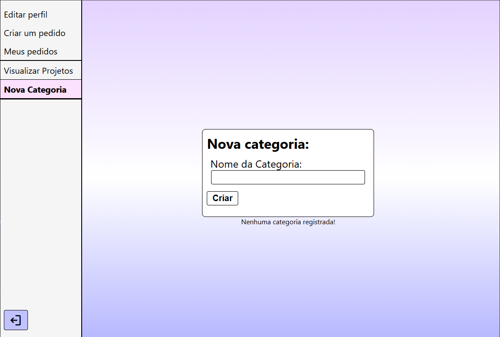

# 📖 O que é
### O projeto Art-Now simula um site onde o cliente requisita um pedido de arte, onde ele envia a descrição de como quer a arte, escolhe uma categoria e envia referências caso queira. Após o cliente criar um pedido, o artista poderá acessar uma sessão onde verá todos os pedidos que foram requisitados, tendo acesso as informações do cliente que o fez o pedido, podendo alterar o status do pedido, recusando ou finalizando o pedido

# 🛠️ Ferramentas Utilizadas

  Node.js  
  React.js  
  MySQL  
  JavaScript  
  HTML  
  CSS  

# 🎯 Funcionalidades
☑ API RESTful  
☑ Cadastro de usuários  
☑ Validação de login  
☑ JWT para Autentificação e Autorização do usuário  
☑ Armazenamento de imagens no servidor  
☑ Criptografia de senhas com Hash (bcrypt)  

# 🎞 Visual do Projeto

## LandPage

## Sistema de Login

  
  

## Visualização do perfil

## Tela de Usuário Comum e Tela de Administradores

  
  

## Pedidos Requisitados

## Página de criação de categorias (Somente Administradores)

# ⚙ Como utilizar

O Projeto é dividido em 2 pastas principais, uma para o Front-end e outra para o Back-end, por isso abra 2 terminais individuais
  

## 📦 Front-End

### Navegue até a pasta do Front-End
    cd react-frontend
### Instale as dependências
    npm install
### Inicialize o projeto
    npm start
### Crie um arquivo dotenv para amazenar a URL
    Crie um arquivo '.env'
    Configure a URL gerada pelo servidor no variavel REACT_APP_API_URL
    Exemplo: 
    REACT_APP_API_URL=http://localhost:5000

Isso fará com que toda a aplicação Front-end se conecte com o servidor

## 📦 Back-end

### Navegue até a pasta do Back-End
    cd servidor
### Instale as dependências
    npm install
### Rode o projeto
    npm start

#### O servidor vai rodar, por exemplo, em http://localhost:5000 (depende da sua configuração). O React normalmente sobe em http://localhost:3000.

## 🗄️ Configuração do Banco de Dados

Para executar o projeto corretamente, é necessário ter um banco de dados MySQL rodando
 

### Criando o Banco de Dados

Acesse seu MySQL via terminal ou ferramenta como MySQL Workbench e crie um banco de dados:
        
    
    CREATE DATABASE artnow_db;

## Configurando as Credenciais
### Crie um arquivo .env na pasta servidor com as seguintes variáveis:
    MYSQL_DATABASE=artnow_db
    MYSQL_USER=seu_usuario
    MYSQL_PASSWORD=sua_senha
    MYSQL_HOST=localhost
    MYSQL_PORT=3306
    
🔐 Substitua 'seu_usuario' e 'sua_senha' pelas suas credenciais do MySQL  
📌 O arquivo deve se chamar apenas .env 

## 📡 Endpoints que serão criados

### 📥 **GET**

| Rota                            | Descrição                                                                | Permissão       |
|:--------------------------------|:-------------------------------------------------------------------------|:----------------|
| `/categorias`                   | Retorna todas as categorias disponíveis                                 | Pública         |
| `/login/user`                   | Realiza login automático via JWT e retorna dados do usuário autenticado | Autenticado     |
| `/pedidos`                      | Retorna todos os pedidos do usuário autenticado                         | Autenticado     |
| `/pedidos/admGetUser/:id`       | Retorna informações de um usuário específico                            | Admin           |
| `/pedidos/admGetAll`            | Retorna todos os pedidos de todos os usuários                            | Admin           |
| `/pedidos/admGetOne/:id`        | Retorna detalhes de um pedido específico                                 | Admin           |

---

### 📤 **POST**

| Rota                            | Descrição                                                                | Permissão       |
|:--------------------------------|:-------------------------------------------------------------------------|:----------------|
| `/categorias`                   | Cria uma nova categoria                                                  | Admin           |
| `/login/signin`                 | Realiza autenticação do usuário                                          | Pública         |
| `/login/signup`                 | Cadastra um novo usuário (senha criptografada com Bcrypt)                | Pública         |
| `/login/deleteuser/:id`         | Deleta o usuário, seus pedidos e imagens                                 | Autenticado     |
| `/pedidos`                      | Cria um novo pedido e armazena as referências enviadas                   | Autenticado     |

---

### 📝 **PATCH**

| Rota                            | Descrição                                                                | Permissão       |
|:--------------------------------|:-------------------------------------------------------------------------|:----------------|
| `/categorias/:id`               | Atualiza informações de uma categoria específica                        | Admin           |
| `/login/edituser/:id`           | Atualiza os dados de um usuário específico                               | Autenticado     |
| `/pedidos/admAlterarStatus/:id` | Altera o status de um pedido específico (ex: pendente, recusado, finalizado) | Admin       |

---

### ❌ **DELETE**

| Rota                            | Descrição                                                                | Permissão       |
|:--------------------------------|:-------------------------------------------------------------------------|:----------------|
| `/categorias/:id`               | Remove uma categoria                                                     | Admin           |
| `/pedidos/:id`                  | Deleta um pedido e suas referências                                       | Autenticado     |

